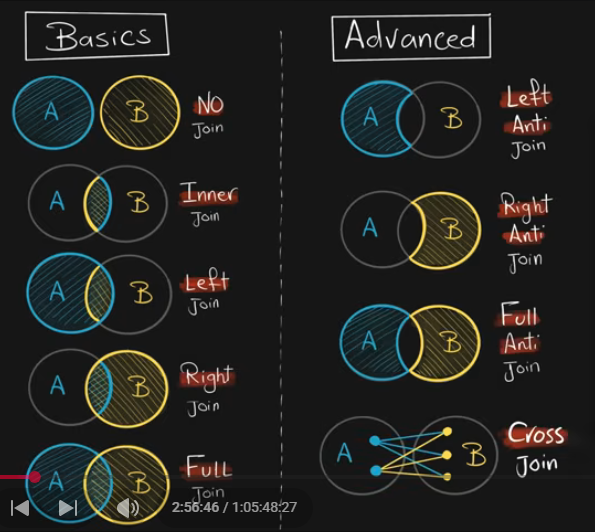
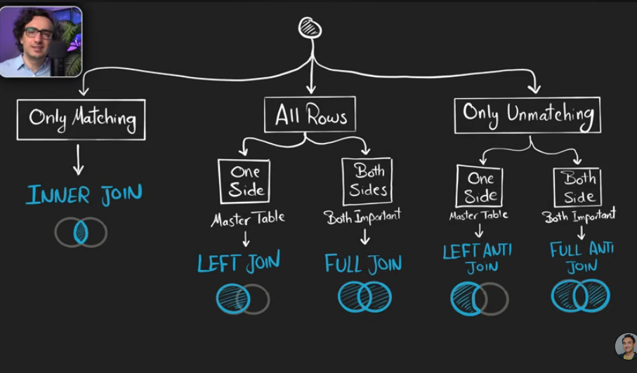
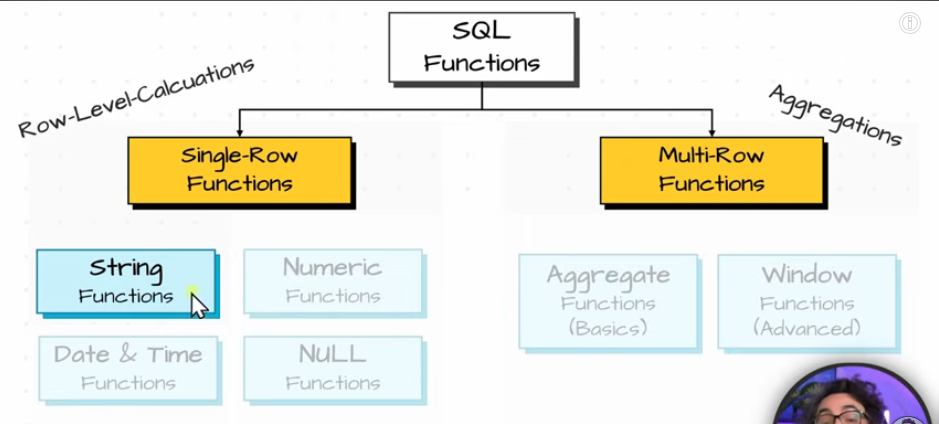
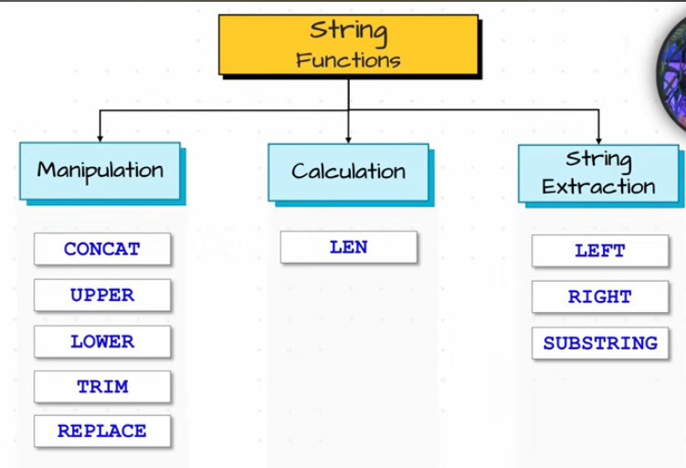
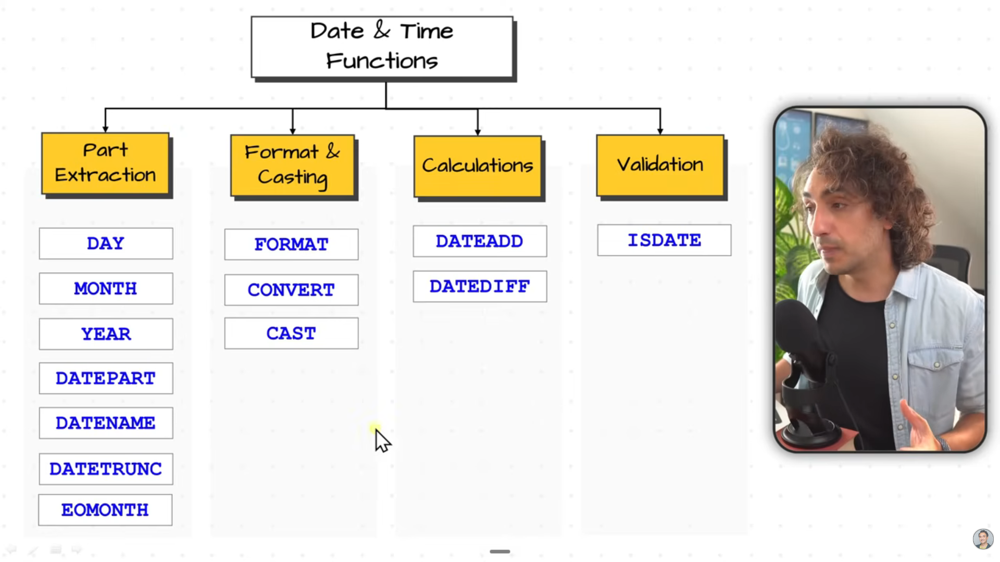

NOTES OF SQL:

SQL IS CASE INSENSITIVE, NO EFFECTIVE OF CAPITALS, SMALLS AND all

SQL QUERY ORDER:

Select
distinct
top
from
join
where 
Group by
Having
ORDER by

"""
SELECT DISTINCT TOP 3
    c.class_name,
    COUNT(s.student_id) AS total_students,
    AVG(s.marks) AS avg_marks
FROM students s
JOIN classes c
    ON s.class_id = c.class_id
WHERE s.marks > 70
GROUP BY c.class_name
HAVING COUNT(s.student_id) >= 1
ORDER BY avg_marks DESC;
"""

Select * -  select all columns of all rows of the table
E.g: Select Name,Country From table

Where - Filters your data based on a condition
E.g: Select * from table where Country='India'

Order By- SORT UR DATA - ASC OR DESC
E.g: Select * from table order by Score ASC/Desc
     Select * from customers order by country ASC, score Desc

gROUP by - Combines rows with same value aggregrates a column by another column
E.g: Select  Country  ,  Sum(Score) as total score From table Group By country 
           group by category
     THE TOTAL SCORE JUST EXISTS IN THE QUERY ANSWER JST A TEMP Name

""
    IF GROUP BY IS USED THEN THE THINGS MENTIONED AFTER SELECT SHOULD BE EITHER AGGREGATE FUNCTIONS LIKE MAX SUM
     AND ALL OR MENTIONED IN THE GROUP BY OR ELSE THE SOFTWARE IS CONFUSED
""

Having - Filter aggregrated data after Group by
E.g: Select country, sum(score) from table group by country having "CONDITION"
                                                                    should use
 the aggregrated word like count sum and all that are used in the things after select

E.g: Select Country,Avg(score) from customers where score!=0  group By country having avg(score)>430

Distinct -  removes duplicates and each value only appears once
after select

Top(Limit) -  Restrict the No of rows returned
Select top 3 from table 
only 3 rows are given

DATA DEFINITION LANGUAGE:
 
USED TO DEFINE OR CHANGE THE STRUCTURE OF DATABASE OBKECTS

        CREATE          ALTER           DROP        TRUNCATE

E.G;
CREATE table persons(
    id INT NOT NULL,
    PERSON name Varchar(50) NOT NULL 
    birth_Date Date,
    phone Varchar(15) NOT NULL
    Constraint pk_persons PRIMARY KEY(id)
)

Alter -  will add a new coloumn
ALTER TABLE persons ADD email VARCHAR(50) NOT NULL
                     Drop COLOUMN phones

Drop - Remove the table completely from the database
Drop table persons

DATA MANIPULATION LANGUAGE:

USED TO MANAGE DATA INSIDE THE TABLE

            INSERT      UPDATE      DELETE       SELECT

INSERT into table name (COLOUMN 1, COLOUMN 2,...) 
VALUES (VALUE 1,VALUE 2,....)

UPDATE table_name
Set coloumn1=val1,
     coloumn2=val2
     where <condition>

Delete from table_name where <condition>

Filtering data
comparision operators 
all are Where opertors

=         <> / =!        >         <         >=         <=

AND       OR

BETWEEN
INCLUSIVE OF THE BOUNDARIES

IN                  NOT IN
LIST VALUES 

E.G: 
SELECT * FROM CUSTOMERS WHERE COUNTRY IN ('germany' , 'USA')

LIKE
search for a pattern in SQL
% - anything
_ - exact 1

Combining Data:

SETS                AND                 JOINS

For columns, we use join. For rows, we use sets. 

There are four types of joins:
- Inner join
- Full join
- Left join
- Right join

The types of sets are:
- Union
- Union all
- Intersect

The uses of joining a table are:
- to recombine data  a big picture
- data enrichment  extra info
- and check existence filtering

Select * from A inner join B on <condition>
                                 A.key=b.key

""

Select c.id,c.first_name,o.order_id,o.sales
     From customers As c
     Inner Join order as o
     ON c.id=o.customer_id

""

Left-anti join 
Select * from A left join B on A.key = B.key where B.key is null 

Full-anti join 
Select * from A left join B on A.key = B.key where B.key is null  or A.key is null

Cross join: it combines every row from left with every row from right. All possible combinations. CARTESIAN join 

VERY VERY IMP

SET 

UNIOIN       INTERSECT    EXCEPT        UNION ALL
#1 RULE  ORDER BY can be used only once
2 RULE  Same Number of Columns
3 RULE  Matching Data Types
4 RULE  Same Order of Columns
5 RULE  First Query Controls Aliases
#6 RULE  Mapping Correct Columns

UNION - REMOVES DUPLICATES
UNION ALL - DOESNT REMOVE DUPLICATES 

STRING FUNCTIONS
:
LOWER()
SUM()

Nested functions
LOWER(LEFT('Maria',2))

sql functions photo

string functions :  

Getdate() -> gives todays date

date and time funcitons: 

NULL FUNCTIONS

isnull coalesce - replace null with value
ISNULL(value,replacement_value)
if value is null then only it will use the replacement value

 COALESCE(value1,value2,value3 )

nullif - value to null

is null  - true/false

